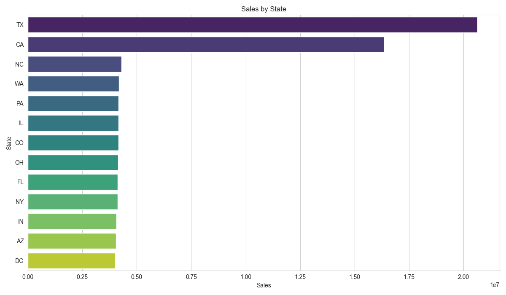
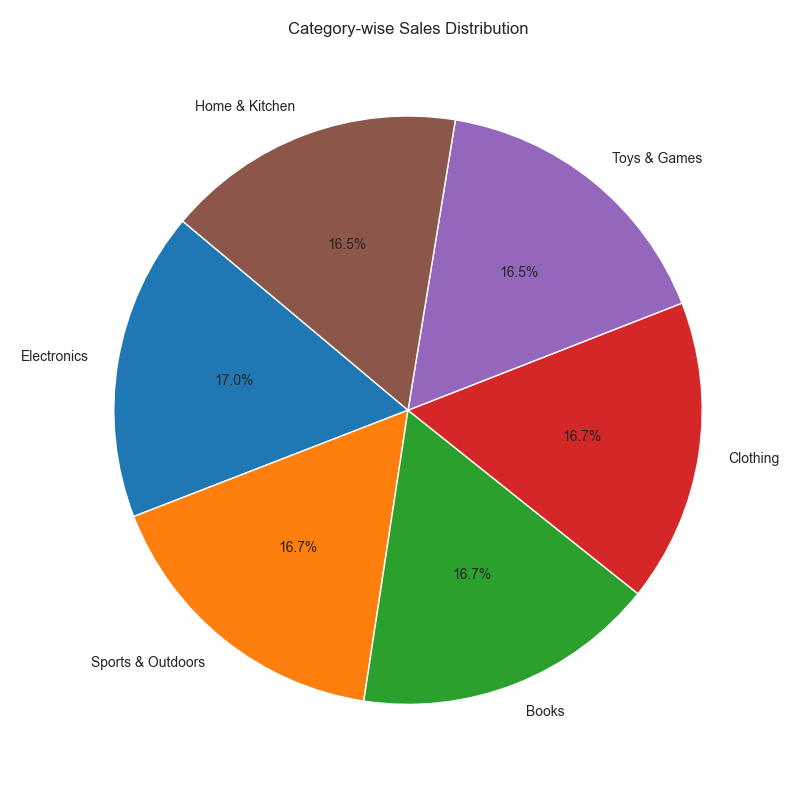
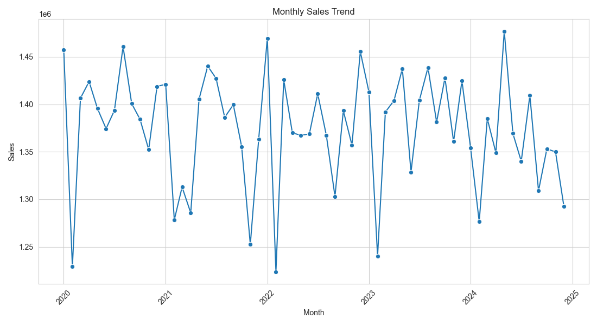
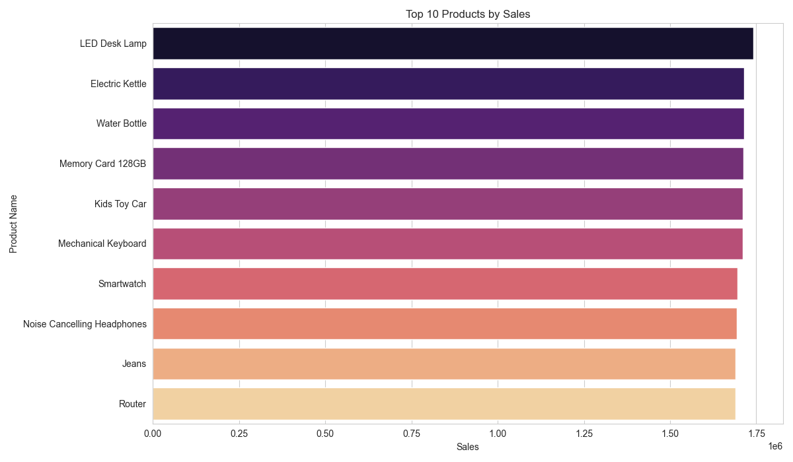

# 📊 Amazon Sales Analytics using Excel & Python

> A comprehensive data analytics project built using **Microsoft Excel** and **Python** to analyze Amazon sales data, identify business trends, and provide actionable business recommendations.

---

## 🚀 Project Overview

This project was completed as part of the **Excel to Python Analytics Bootcamp** organized by **DevTown** in collaboration with **Google Developers Group (GDG)** and **Microsoft Student Chapter (MSC)**.

The objective of this project is to analyze Amazon sales data using Excel and Python, create an interactive dashboard, visualize key business metrics, and derive meaningful insights to support data-driven decision-making.

---

## 🎯 Project Objectives

- Clean and preprocess the sales dataset
- Perform Exploratory Data Analysis (EDA)
- Calculate key business KPIs
- Analyze sales across different states and categories
- Identify top-performing products and customers
- Visualize sales trends using charts
- Build an interactive Excel Dashboard
- Provide business recommendations based on insights

---

## 🛠️ Technologies Used

| Tool | Purpose |
|------|---------|
| Microsoft Excel | Dashboard & Pivot Tables |
| Python | Data Analysis |
| Pandas | Data Cleaning & Manipulation |
| NumPy | Numerical Operations |
| Matplotlib | Data Visualization |
| Jupyter Notebook | Python Development |

---

## 📂 Project Structure

```
Amazon-Sales-Analytics/
│
├── amazon.xlsx
├── Dashboard.xlsx
├── Amazon_Sales_Analysis.ipynb
├── Amazon_Sales_Analysis.py
├── README.md
│
├── Charts/
│   ├── sales_by_state.png
│   ├── category_sales_pie.png
│   ├── monthly_sales_trend.png
│   └── top_10_products.png
│
└── Report/
    └── Business_Recommendations.md
```

---

## 📈 Key Performance Indicators (KPIs)

- ✅ Total Sales
- ✅ Total Profit (Estimated)
- ✅ Total Orders
- ✅ Average Sales
- ✅ Average Profit
- ✅ Maximum Sales
- ✅ Minimum Sales

---

## 📊 Analysis Performed

- Sales by State
- Sales by Category
- Sales by Brand
- Top 10 Products
- Top 5 Customers
- Payment Method Analysis
- Monthly Sales Trend
- State-wise Category Analysis

---

## 📉 Visualizations

The project includes the following visualizations:

- 📍 Sales by State (Bar Chart)
- 🥧 Category-wise Sales Distribution (Pie Chart)
- 📈 Monthly Sales Trend (Line Chart)
- 🏆 Top 10 Products by Sales (Horizontal Bar Chart)

---

## 💡 Business Insights

- Identified the highest-performing states based on sales.
- Analyzed customer purchasing behavior.
- Evaluated preferred payment methods.
- Identified top-selling products and categories.
- Examined monthly sales trends to identify seasonal patterns.

---

## 🚀 Business Recommendations

- Increase marketing efforts in high-performing regions.
- Promote top-selling products through targeted campaigns.
- Optimize discounts and shipping costs to improve profitability.
- Reward loyal customers with personalized offers.
- Plan inventory based on monthly sales trends.

---

## 📚 Learning Outcomes

Through this project, I gained hands-on experience in:

- Data Cleaning
- Data Analysis using Pandas
- Exploratory Data Analysis (EDA)
- KPI Calculation
- Data Visualization
- Excel Dashboard Development
- Business Intelligence Reporting

---

## 📊 Charts Preview

```markdown
### Sales by State


### Category-wise Sales


### Monthly Sales Trend


### Top 10 Products

```

---

## ▶️ How to Run the Project

1. Clone the repository

```bash
git clone https://github.com/your-username/Amazon-Sales-Analytics.git
```

2. Open the project folder.

3. Install the required libraries.

```bash
pip install pandas numpy matplotlib openpyxl
```

4. Run the Python script.

```bash
python Amazon_Sales_Analysis.py
```

Or open the Jupyter Notebook.

```bash
jupyter notebook Amazon_Sales_Analysis.ipynb
```

---

## 📄 Dataset

The dataset used in this project is based on an Amazon sales dataset available on Kaggle.

---

## 👨‍💻 Author

**Syam Kumar**

🎓 B.Tech – Computer Science Engineering

💻 Passionate about Python, Data Analytics, Machine Learning, and Problem Solving.

---

## ⭐ Support

If you found this project useful, consider giving it a ⭐ on GitHub.

---

## 📜 License

This project is created for educational and learning purposes.